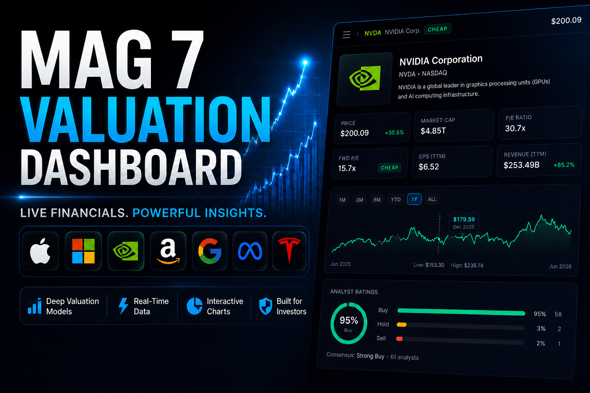

# Mag 7 Valuations



A trading-card-style stock valuation app for the "Magnificent 7" (AAPL, MSFT, GOOGL, AMZN, NVDA, TSLA, META) — live at **[mag7valuations.vercel.app](https://mag7valuations.vercel.app)**.

Open a foil pack, pull 7 holographic cards, and dive into full valuation breakdowns for each company — or pick two and compare them head-to-head, stat by stat.

Built as my first real web project while learning Next.js, TypeScript, and API-driven financial data.

## Features

- **Pack opening** — tear open a foil pack to reveal all 7 cards with a holographic shimmer effect
- **Stock detail view** — Overview / Financials / Valuation tabs per company, 4-year financial statements, price + P/E charts, analyst ratings
- **Compare** — pick any two stocks for a 1-vs-1 side-by-side comparison with per-stat winner highlighting (P/E, EPS, revenue growth, margins, ROE, debt/equity, FCF, analyst consensus)
- **Educational tooltips** on every metric, written in plain English
- Fully responsive, including a dedicated mobile layout for the Compare flow

## Stack

- **Next.js 14** (App Router) + **Tailwind CSS** + **Framer Motion**
- No backend — live financial data fetched directly via the [`yahoo-finance2`](https://www.npmjs.com/package/yahoo-finance2) package inside Next.js API routes
- Deployed on **Vercel**

## Running locally

```bash
pnpm install
pnpm dev
```

Then open [http://localhost:3000](http://localhost:3000).

## Disclaimer

Built as a research and learning tool. Not investment advice. Data may be delayed up to 15 minutes.
